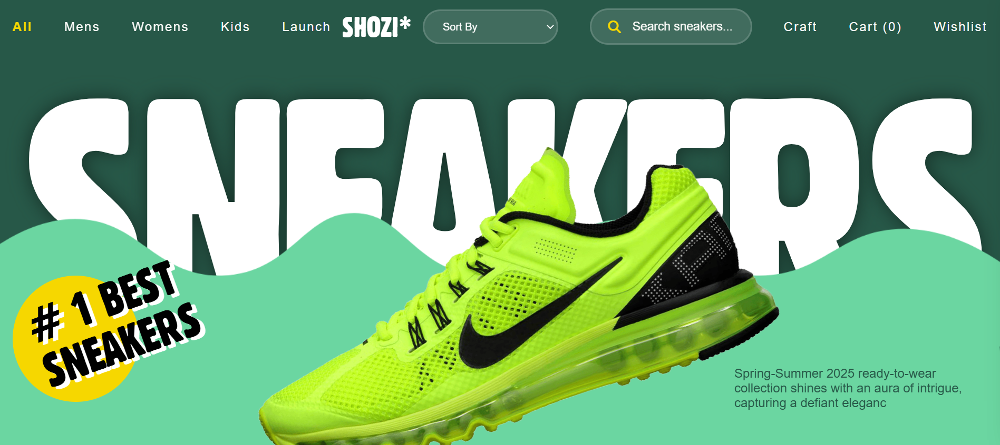
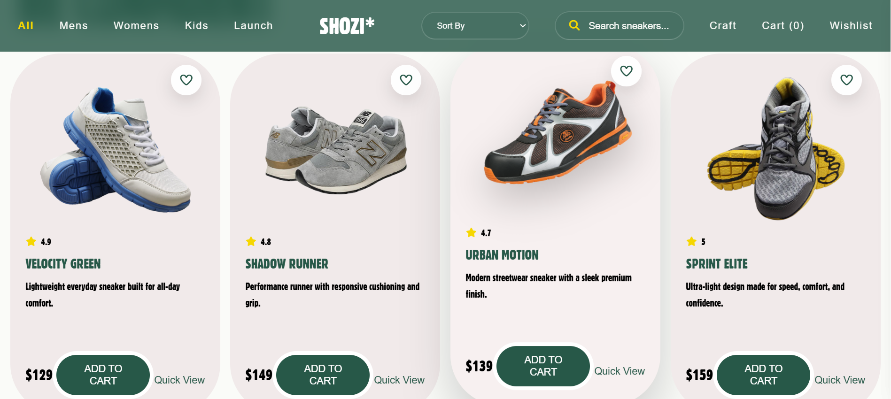
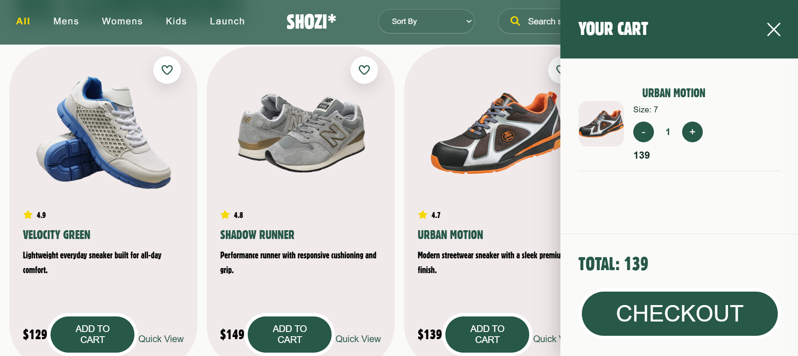
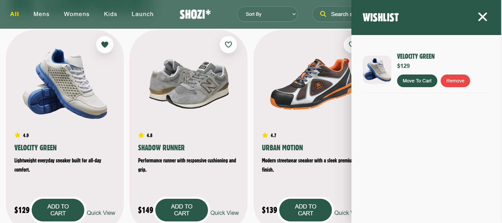
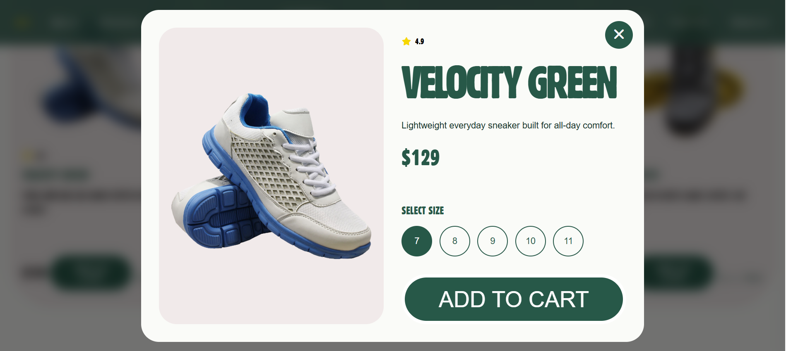
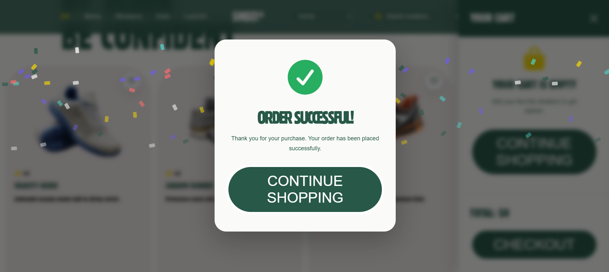

<p align="center">
  
</p>

# 👟 NikeVerse – Premium Sneaker Store

A modern, fully responsive sneaker shopping experience built using **HTML**, **CSS**, and **Vanilla JavaScript**.

Designed with smooth animations, premium UI/UX, wishlist support, shopping cart functionality, quick product previews, checkout flow, and responsive layouts.

---

## 🌐 Live Demo

🔗 **https://shozi-store.netlify.app/**

---

## 📸 Project Preview

### Home Page



### Product Collection



### Shopping Cart



### Wishlist



### Quick View



### Checkout



---

# ✨ Features

* Premium Landing Page
* Fully Responsive Design
* Animated Loader
* Smooth Scroll Animations
* Product Categories
* Product Search
* Product Sorting
* Shopping Cart
* Wishlist
* Quantity Management
* Quick View Modal
* Product Size Selection
* Checkout Form
* Order Summary
* Success Animation
* Toast Notifications
* LocalStorage Support
* Mobile Navigation
* Professional UI/UX

---

# 🛠 Tech Stack

* HTML5
* CSS3
* Vanilla JavaScript (ES6)
* Font Awesome
* LocalStorage API

---

# 🚀 Getting Started

Clone the repository

```bash
git clone https://github.com/Azeem-Toretto-1/Shozi.git
```

Navigate into the project

```bash
cd Shozi
```

Run the project

Simply open **index.html**

or launch it with **Live Server** in VS Code.


---

# 📂 Project Structure

```
NikeVerse/

│── assets/
│── fonts/
│── screenshots/
│── index.html
│── style.css
│── script.js
│── README.md
```

---

# 📱 Responsive

Optimized for

* Desktop
* Laptop
* Tablet
* Mobile

---

# 🎯 Future Improvements

* Product Details Page
* User Authentication
* Payment Gateway
* Order History
* Backend Integration
* Dark Mode
* Product Reviews
* Firebase Authentication
* Stripe Checkout

---

# 👨‍💻 Author

**Azeem Malik**

### GitHub

https://github.com/Azeem-Toretto-1/Shozi

### LinkedIn

https://www.linkedin.com/in/azeem-toretto

---

# ⭐ Support

If you like this project, consider giving it a ⭐ on GitHub.

It helps the project grow and motivates future improvements.

---

# 📄 License

This project is licensed under the MIT License.
